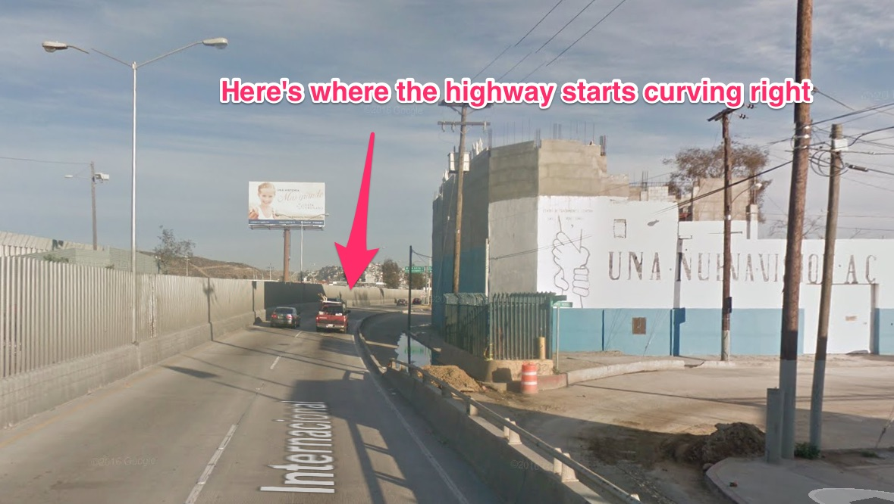
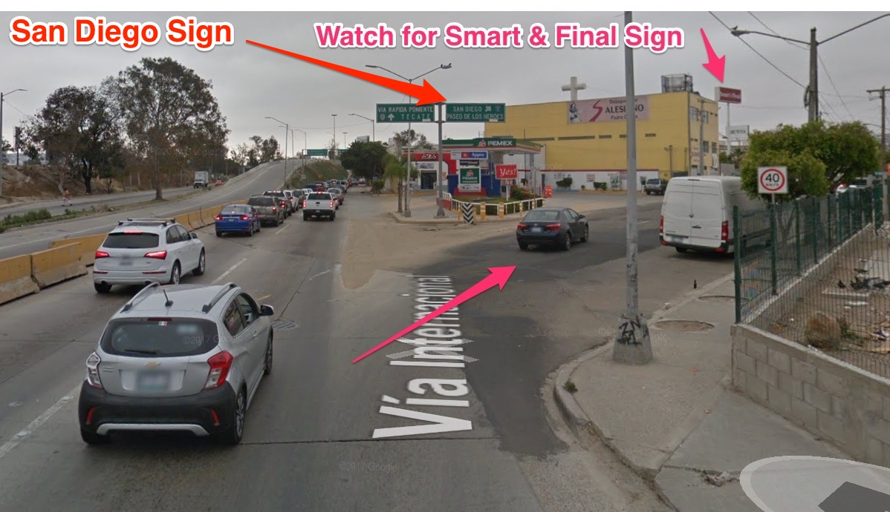

# Driving Instructions to Estero Beach Resort from Orphanage

Here's an overview map of the trip to **Estero Beach**:

Here's the **orphanage** address that you're starting from:

> Colegio Guadalupe Victoria 
> Av Hidalgo 787, Obrera 
> 22830 Ensenada 
> B.C., Mexico    

## Use Google Maps

If you have a cell phone w/ free Mexican roaming service, you can
click on the following URL or copy and paste it into
your smart phone's browser:

https://www.google.com/maps/dir/Av+Hidalgo+787,+Obrera,+22830+Ensenada,+B.C.,+Mexico/31.7783925,-116.6135683/@31.8159713,-116.630355,13.18z/data=!4m8!4m7!1m5!1m1!1s0x80d8927852c6c6c7:0xc393f52602284365!2m2!1d-116.6110487!2d31.8655246!1m0
 
instead of following the route instructions below.
    
1.  It leaves from the orphanage.
1.  It drops you off right next to the Estero Beach hotel's office.
    
## Route Instructions
    
Here are the instructions to **Estero Beach**:

1.  Pull out of the court yard and turn **left** onto the street
    in front of the orphanage (**Av Hildago**)
1.  Turn **right** at the first street you come to (**Calle Octava**)
1.  Turn **right** at the busy boulevard (**Av Reforma**): 
    .
1.  Drive virtually straight for **5.5 miles**.  It turns into **Highway 1**
    so you know you're on the right route.    
1.  Look for the Estero Beach Resort sign on the right: 
    
1.  Turn **right** at the next street (**Av Gral Lazaro Cardenas**). After
    turning, it should look like this: 
    
1.  Drive to the end of the street where it "tee's" into
    **California y o Tercera**: 
    
1.  Turn left, and drive until you get to the Estero Beach Restort **entry gate**: 
    
1.  Inform the **gate keeper** that you are a guest at the hotel.  He will
    permit you to proceed.  Follow this map to parking and then go into the
    office: 
    
1.  After arranging your visit, the staff will direct you to your room.  Be
    sure to inquire about acquiring a **Fast Pass** that will substantially
    reduce your time to cross the border when you return.
    
It is a beautiful place.  Walk around a bit; find your room and then go to
the restaurant where the "old-timers" will be waiting to greet you.

---

# Return Trip for Fast Pass Holders

## Fast Border Return

If you stayed Saturday night at **Estero Beach Resort** or ate at
a nice Mexican restaurant, be sure to ask for a "fast pass" certificate.
You can use this to cut your
border crossing time from >3 hours to maybe 45 minutes; well worth it.

Be sure to carefully follow the driving recommendations suggested in the
certificate; it can be tricky to navigate if you don't.
Talk w/ members of the group who have used **Fast Pass**; they will
have suggestions for making sure you use the correct route.

This guide is what I've used.

## Using Google Maps Directly

If you have a cell phone w/ free Mexican roaming service, you can
click on the following URL or copy and paste it into
your smart phone's browser:

https://www.google.com/maps/dir/Unnamed+Road,+Estero+Beach,+22785+Ensenada,+B.C.,+Mexico/32.5364198,-117.0281136/@32.1678603,-117.0850363,10z/data=!3m1!4b1!4m9!4m8!1m5!1m1!1s0x80d89026002c793b:0x4ab09b6cc9e0bcdc!2m2!1d-116.6138712!2d31.7782041!1m0!3e0

1.  They take you from the Estero Beach Hotel's parking lot exit to the **fast pass**
    gate in Tijuana.
1.  The recommended route is exactly the one I have taken; it's worked for me.
1.  It is a lot easier than following the directions below.

## Drive to the US Border

Here goes:

1.  Exit the **Estero Beach Resort** by driving out past the guard gate.
1.  Turn right onto **Av. Lázaro Cárdenas**.
1.  Left at the signal (**Highway 1**).
1.  Drive **straight** up **Highway 1** for **4.0 miles**.
1.  You will drive upon a bridge.  Take the right offramp at the end of the bridge.
    In the picture, you can see the cloverleaf descending down to the road below: 
    
1.  Go straight through the first cross street (**Av_dr_Pedro_loyola**): 
    
1.  Turn right at the next cross street onto **Highway 3**. *Note it is probably not
    marked*: 
    
1.  Stay on **Highway 3** as it goes through the Ensenada seaport and then runs along
    the beach.  You will several miles until you reach a tiny freeway intersection.
    Bear **left** towards **Tijuana**: 
    
1.  Drive until you come to a fork where you choose to drive the scenic **toll** road
    or the free **libre** road.  Bear **left** onto the scenic toll road: 
    
1.  You will arrive at the first toll booth.  Pay and proceed.

> Enjoy the scenic road.  When you are past the last **(3rd)** toll booth, it will be
> time to pay attention to the driving instructions again.

1.  After the last toll booth, in a
    few miles you will notice you are climbing up a hill next to the **US
    border fence**: 
    
1.  You will climb to the top of the hill.
    As you come down, watch for the **San Diego** offramp: 
    
1.  You will go up a steep hill again, and then notice you are driving parallel
    to the **US border** (again): 
    
1.  Drive 2 miles or so **straight ahead** until the
    highway starts curving to the right: 
    
1.  *Important!:* Turn **right** on the street where you can see the **Smart & Final**
    sign: 
    
1.  Turn **left** at the **first signal**: 
       
1.  *Important!:* You will quickly encounter 5 signs and 3 roads to choose from.  Just
    take the middle one (**Col. Federal**): 
    
1.  You will make a long 360 degree circling up onto a bridge.  Keep
    going until you can bear left to a gate as shown here: 
    
1.  There an official will process your **fast pass**.  It if passes muster,
    he will open the gate for you, and your wait to cross the border
    will be cut by around 70% (or more).
    
Enjoy the goings-on as you wait to cross the border.  Be sure you have your
**passports** ready to hand over to the border agents.

*Merry Christmas!  See you next year.*
