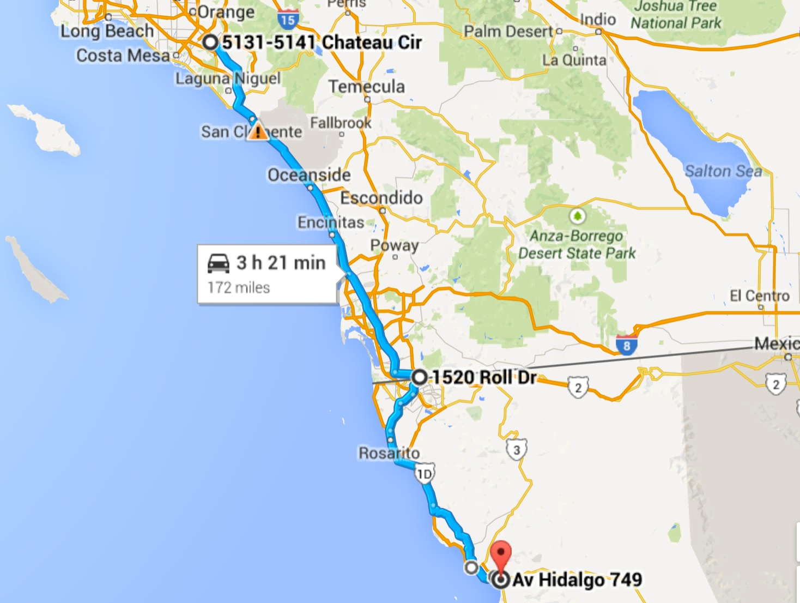
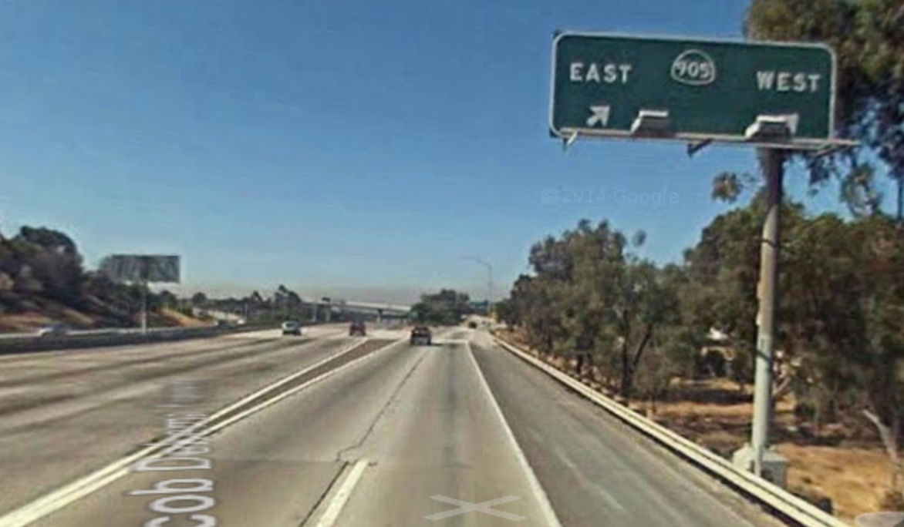
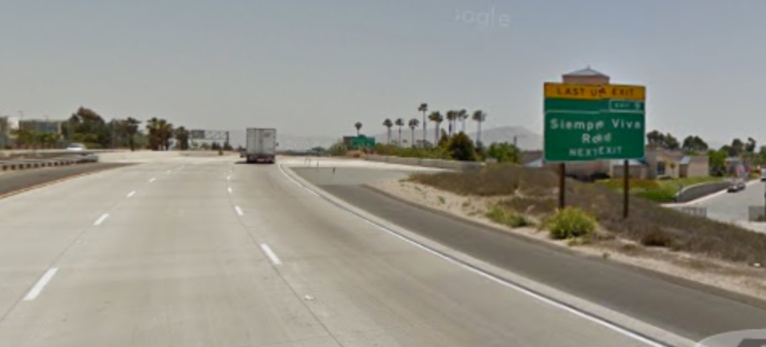
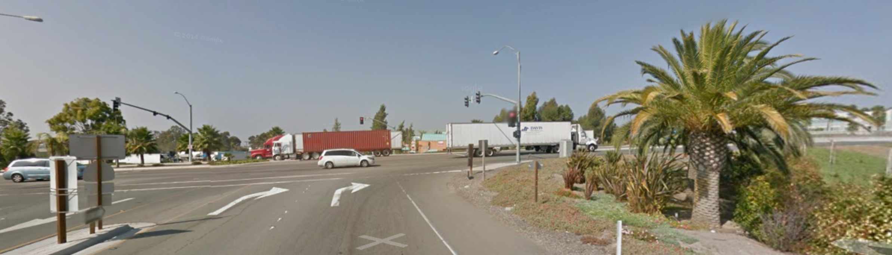
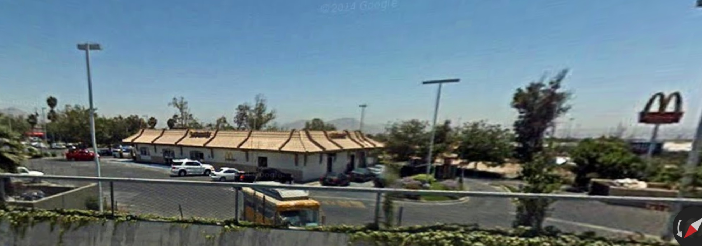
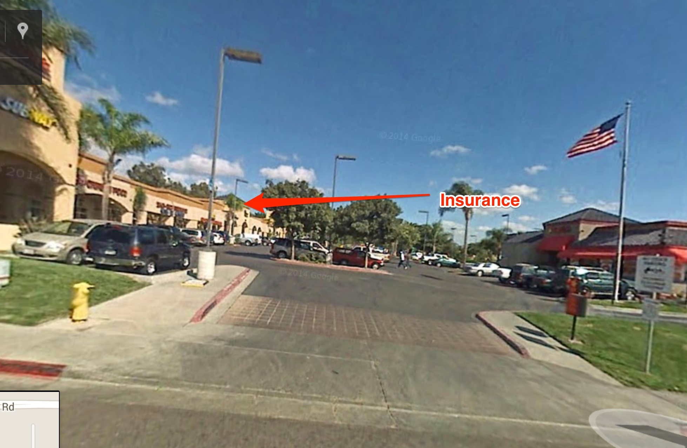
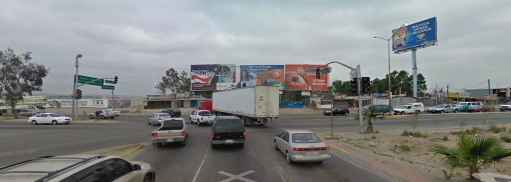

# Driving Instructions to Orphanage from Dianne's House

These instructions can be accessed two ways:

* As a paper handout; see Dianne.
* As a PDF file in your smart phone.  The iPhone, for one, has *iBooks* which
can hold a PDF file in your smart phone's memory and access it.  Once loaded,
you don't have to have a live Internet connection; this is handy when you want to
turn off access in México to avoid (expensive!) roaming charges.

## Assumptions

**Does everyone in your party have a passport?  If not, now is a good time to go retrieve it!**

1.  Starts from Dianne's house.
1.  Ends at the orphanange in Ensenada.
1.  You should preferably have a navigator reading these instructions.

Okay, let's go.

## Trip Instructions

Here's an overview map of the trip:

You can see that I've broken this into two sections:

* The border (**McDonalds**) at **1520 Roll Drive**.
* The drive in **México** to the **orphanage**.

### The border - McDonalds

1.  Use the ways you already know to head south towards **San Diego** (on the **5**
 or **405**; doesn't matter).
1.  After the **El Toro Y** (the confluence of the **5** and **405** freeways), continue for
approximately **66 miles** until you encounter the **805/5 interchange**.
1.  Continue onto the **805** freeway.
    

1.  Continue driving approximately **26** miles until you see signs for the **CA 905**.
    Take this exit **east**.
    
    

1.  Continue driving approximatly **6** miles until you see Siempre Vive Road.
    Exit here; take the **east** direction.
    
    

1.  Here's the map of the border area with a few notes on following instructions:
    
    

1.  At the intersection, turn **right**:
    
    

1.  As you cross over the **905** freeway below you, on the **right** you will notice
    **McDonalds**.  That is where we are meeting.
    
    You get there by turning **right** on **Roll Drive** and turning into the parking lot.
    

You will see other members of the team parked there.  Some things to consider:

1.  Breakfast: There is time for you to get something from McDonald's and eat.
1.  Restroom break: Use McDonalds's.
    

1.  If you haven't yet obtained Mexican auto insurance, you can do so on the
    other side of **Roll Drive**:
    
    

1.  Buy gas if you don't have enough to get back w/o filling up.  I've filled up
    in Ensenada, and I didn't observe any adverse effects to my car, but if you're worried
    about it, buy gas here.
1.  Also, have about $10 available for tolls on the beautiful Ensenada Scenic Road.
    They take US dollars.

## Drive to Orphanage (México here we come!)

### If you haven't driven in México before

Relax.  It's not that hard.  The biggest fear I've seen in newcomers is getting
lost.  Fortunately, there are not that many turns to make on this phase of the
trip, and this document makes a huge effort to make sure you make the turns you
need to make.

Other observations:

1.  People drive much slower in México.  Unlike the United States where we try
    to make the roads as safe as possible (and drivers get so bored they talk
    on their cellphones and cause accidents), roads in México are more primitive
    and you HAVE to pay attention (which is a GOOD thing).  Fortunately, we're
    driving in daytime, and the landmarks you need to see are not hard to spot.
1.  Drivers are courteous in México; be courteous to them.  I see much less
    reckless driving in México than in the states.

### Turn off roaming in your smartphone

Unless you have international roaming, you could be hit with a really nasty charge
on your next bill.

Besides, if you downloaded this document into your smartphone, you won't need
internet connectivity anyways.

If you don't know how to stop roaming on your cellphone, then put it
into *Airplane Mode*.

### We're going to stop for customs first.

Ironically, we drive across the border and, in a hundred feet or so, will pull
into a parking area and stop.

1.  ***We will go over as a group because Mexican customs wants to see us as a group.
    Don't go off on your own yet!***
1.  Parking is crowded.  If you can, pull in behind one of our cars to leave
    space for others.  I'm amazed and heartened by how much everyone works together
    to provide space for everyone
1.  Don't worry, we don't pay anything.
    You have been given papers that explain everything; provide it to a customs
    officer if he asks (I don't remember the last time we were asked).

### Okay, here we go:

1.  Turn **left** out of the **McDonald's** parking lot back onto **Roll Drive**.
1.  Turn **right** onto **Siempre Viva Road** (you have no choice; **Siempre Viva
    Road** is one-way here).
1.  Make a **U-turn** at your first opportunity.
1.  Turn **left** to merge onto the **905** freeway toward **Otay Mesa Border Crossing**.
1.  Proceed for approximately **0.4** miles where you will follow the "convoy" into **México**.
1.  Stay with the "convoy" to your **right** into the customs area.

### While Waiting for Customs:

1.  Since customs can take up to 30 minutes or so, you can stretch your legs and
    walk around.
1.  When the customs officials have finished processing,
    we'll be permitted to leave.  *At this time, if you want to "leave the convoy" to drive on your
    own for the remainder of the trip,
    then* ***let Dianne know so we won't be searching for you.***

### On Into Mexico:

1.  Merge onto **Blvd garita de Otay** and stay in the **right** lane.
1.  Take the **ramp** to turn **right** onto **Blvrd De Las Bellas Artes**.
1.  In about 0.7 miles the road will end at a "tee" intersection.
1.  At the tee, turn **left** onto highway **2** towards **Rosarito**:
    

At this point, follow the signs towards **Rosarito**.  You should stay on Highway **2** and then
proceed onto Highway **1** when you get to it.  Always drive towards **Rosarito** until you see signs
for **Ensenada**; at that time follow signs for **Ensenada**.

When you get close to the ocean, you should merge onto the **Ensenada Scenic Highway**
towards **Ensenada**.  *Be ready to pay tolls; last year we paid under $5.00 US dollars*.

When you arrive at the outskirts of **Ensenada**, the **Scenic Highway** ends and becomes
a 4-lane highway with signals.  We're on the outskirts of **Ensenada** now;
here's an overview map for the remainder of the trip:

Continue with the *remaining* instructions:

1.  Continue for about **4.5** miles and bear **left** onto **Bahía de La Paz**:
    
    

1.  Continue for **2** miles and **merge** onto **Décima**:
    
    

1.  Continue for **0.7** miles, then **turn** right onto **Av Riveroll**:
    
    

1.  Turn left at the first intersection (**Novena**):
    
    

1.  Continue for **0.5** miles *continuing past* the **extra** store on the **right**:
    
    

1.  Keep going straight.  At the end of the block, turn **right** (**Av Hidalgo**):
    
    

1.  Continue for **one block**, then the **orphanage** is on the **right**:
    
    The **black metal gate** will be open and you can drive into the courtyard.
    

*Congratulations, you have arrived!*

